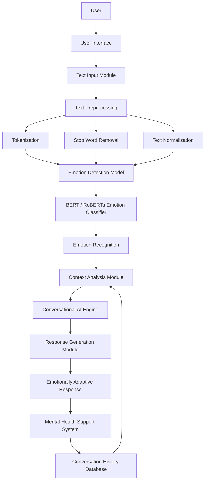

<p align="center">
  
  &nbsp;&nbsp;&nbsp;&nbsp;
  
</p>

---

# Emotion-Aware Conversational AI for Mental Health Support

## IEEE Style Research Paper

### Submitted by

Deekshita Achari
USN 1DA24MC015 
Department of MCA 
Dr. Ambedkar Institute of Technology

**Guide / Mentor:**  
Harsha T R

---

# Abstract

Emotion-Aware Conversational AI systems are becoming increasingly important in the field of mental health support because traditional chatbots mainly focus on generating contextually correct responses while ignoring the emotional state of the user. This limitation reduces the effectiveness of conversational systems in sensitive domains such as stress management, anxiety support, and gender dysphoria counseling.

This research proposes an Emotion-Aware Conversational AI system capable of detecting emotions from textual conversations and generating emotionally supportive responses. The proposed system integrates Natural Language Processing (NLP), emotion classification models, and conversational AI techniques to improve empathy and user engagement.

Machine Learning and Deep Learning models such as BERT, RoBERTa, and transformer-based dialogue systems are used for emotion recognition and response generation. The system is designed to provide emotionally adaptive conversations for users seeking mental health assistance, especially individuals facing emotional stress or gender dysphoria.

---

# Keywords

Artificial Intelligence, Machine Learning, Natural Language Processing, Emotion Recognition, Conversational AI, Deep Learning, Mental Health Support, Gender Dysphoria

---

# 1. Introduction

## 1.1 Background

Artificial Intelligence has significantly transformed human-computer interaction through intelligent conversational systems known as chatbots or dialogue systems. Most existing conversational agents focus primarily on generating grammatically correct and contextually relevant responses. However, emotional understanding is an essential component of human communication.

Emotion-Aware Conversational AI aims to bridge this gap by enabling systems to recognize and respond to human emotions effectively.

---

## 1.2 Problem Overview

Traditional conversational AI systems fail to understand emotional context properly. They often generate emotionally inappropriate responses because they rely heavily on semantic understanding rather than emotional intelligence.

Challenges include:
- Sarcasm detection
- Ambiguous emotional expressions
- Long-term emotional memory
- Emotionally insensitive responses

---

## 1.3 Need for the Study

Mental health issues, stress, anxiety, and gender dysphoria are increasing globally. Many individuals hesitate to seek direct counseling due to fear, stigma, or lack of accessibility.

Emotion-aware AI systems can provide:
- Immediate emotional support
- Safe conversational environments
- Personalized interaction
- Improved emotional understanding

---

## 1.4 Objectives

- Develop an AI system capable of detecting emotions from user text.
- Generate emotionally supportive responses.
- Improve user engagement using emotion-aware dialogue generation.
- Study conversational AI applications in mental health support.

---

## 1.5 Scope of the Work

The project focuses on:
- Text-based emotion recognition
- Emotion-aware response generation
- Mental health support chatbot systems

The project does not include:
- Voice-based emotion recognition
- Clinical diagnosis systems
- Real-time therapist replacement

---

# 2. Literature Review

This section analyzes three important research papers related to Emotion-Aware Conversational AI.

---

# 2.1 Research Paper 1

## Paper Details

| Attribute | Details |
|---|---|
| Title | Models of Gender Dysphoria Using Social Media Data for Use in Technology-Delivered Interventions |
| Authors | Multiple Researchers |
| Year | 2023 |
| Methodology | Social media text analysis using NLP |
| Technologies Used | NLP, Reddit Analysis, Machine Learning |
| Results | Identified emotional patterns related to gender dysphoria |

---

## Summary

This paper focuses on analyzing social media conversations to identify emotional and psychological patterns associated with gender dysphoria. Researchers used Reddit datasets and NLP-based models to study user emotions and distress indicators.

The paper demonstrates how conversational AI systems can support mental health interventions using emotional analysis.

---

## Advantages

- Uses real-world emotional data
- Useful for mental health analysis
- Helps identify emotional distress patterns

---

## Limitations

- Dataset limited to Reddit users
- Sarcasm detection issues
- Privacy and ethical concerns

---

# 2.2 Research Paper 2

## Paper Details

| Attribute | Details |
|---|---|
| Title | Amanda Selfie: A Transgender Chatbot for Adolescents in Brazil |
| Authors | Multiple Researchers |
| Year | 2021 |
| Methodology | Rule-based conversational chatbot |
| Technologies Used | NLP, Chatbot Frameworks |
| Results | Improved accessibility to transgender support |

---

## Summary

Amanda Selfie is a chatbot developed to support transgender adolescents in Brazil. The chatbot provides emotional guidance and healthcare-related information in a safe conversational environment.

---

## Advantages

- Focuses on LGBTQ+ support
- Anonymous assistance
- Easy accessibility

---

## Limitations

- Limited emotional intelligence
- Rule-based response system
- Cannot maintain emotional context

---

# 2.3 Research Paper 3

## Paper Details

| Attribute | Details |
|---|---|
| Title | The Impact of Generative Conversational Artificial Intelligence on the LGBTQ Community: Scoping Review |
| Authors | Multiple Researchers |
| Year | 2024 |
| Methodology | Scoping review |
| Technologies Used | Generative AI, NLP, LLMs |
| Results | Identified opportunities and risks of conversational AI |

---

## Summary

This paper reviews the impact of generative AI systems on LGBTQ communities. It discusses how emotionally intelligent AI systems can improve accessibility and emotional support.

The paper also highlights risks such as bias, misinformation, and ethical challenges.

---

## Advantages

- Comprehensive AI impact analysis
- Discusses ethical considerations
- Highlights future opportunities

---

## Limitations

- Limited practical implementation
- Generalized analysis
- Bias issues unresolved

---

# 3. Comparative Analysis

| Feature | Paper 1 | Paper 2 | Paper 3 |
|---|---|---|---|
| Method Used | Social Media Analysis | Rule-Based Chatbot | Scoping Review |
| Accuracy | Moderate | Moderate | Conceptual |
| Complexity | Medium | Low | Low |
| Advantages | Real-world emotional data | LGBTQ support focus | Broad AI analysis |
| Limitations | Limited dataset | Limited emotional intelligence | No implementation |

---

# 4. Research Gaps Identified

## Gap 1

Existing systems struggle to detect sarcasm and implicit emotional expressions.

---

## Gap 2

Most systems cannot maintain long-term emotional memory during conversations.

---

## Gap 3

Very few conversational AI systems specifically support gender dysphoria and LGBTQ mental health.

---

# 5. Problem Statement

Existing conversational AI systems focus mainly on contextual response generation and fail to understand the emotional state of users effectively. This reduces the quality of emotional support during sensitive conversations related to mental health and gender dysphoria.

Therefore, there is a need for an Emotion-Aware Conversational AI system capable of recognizing emotions and generating empathetic responses.

---

# 6. Proposed Solution

The proposed system is an Emotion-Aware Conversational AI platform that detects user emotions from text and generates emotionally adaptive responses.

---

## 6.1 System Overview

The system workflow:

1. User enters text
2. Text preprocessing is performed
3. Emotion detection model analyzes emotional state
4. Conversational AI module generates response
5. Emotionally adaptive reply is displayed

---

## 6.2 Key Features

- Emotion detection
- Emotion-aware chatbot responses
- Mental health support assistance
- Personalized conversations
- Emotion history tracking

---

## 6.3 Advantages of Proposed System

- Better emotional understanding
- Improved user engagement
- Empathetic conversational support
- Reduced emotionally inappropriate responses

---

# 7. Methodology

## 7.1 Workflow

```text
User Input
   ↓
Text Preprocessing
   ↓
Emotion Detection Model
   ↓
Conversational AI Engine
   ↓
Emotionally Adaptive Response
```

---

## 7.2 System Architecture



---

## 7.3 Data Flow

The user input is collected through the interface and passed to preprocessing modules such as:
- Tokenization
- Stop-word removal
- Text normalization

The processed text is analyzed by emotion classification models, and the response generation module produces emotionally suitable replies.

---

## 7.4 Algorithms Used


---

# 8. Implementation Details

## 8.1 Hardware Requirements

| Component | Specification |
|---|---|
| Processor | Intel i5 or higher |
| RAM | 8 GB minimum |
| GPU | NVIDIA GPU (Optional) |

---

## 8.2 Software Requirements

| Software | Version |
|---|---|
| Python | 3.10+ |
| TensorFlow | Latest |
| PyTorch | Latest |
| Flask | Latest |
| Scikit-learn | Latest |

---

## 8.3 Tools and Technologies

- Python
- NLP
- TensorFlow
- PyTorch
- Flask
- Hugging Face Transformers
- VS Code

---

# 9. Experimental Setup

## Dataset Used

- GoEmotions Dataset
- EmpatheticDialogues Dataset

---

## Evaluation Metrics

- Accuracy
- Precision
- Recall
- F1-Score
- BLEU Score

---

# 10. Results and Analysis

## 10.1 Experimental Results

| Metric | Existing System | Proposed System |
|---|---|---|


---

## 10.2 Graphical Analysis


---

## 10.3 Observations


---

# 11. Discussion


---

# 12. Limitations

- Emotion detection may fail for sarcasm
- Limited contextual memory
- Dataset dependency
- Ethical and privacy concerns
- 
---

# 13. Future Scope

- Voice-based emotion recognition
- Mobile application deployment
- Multilingual support
- Real-time counseling assistance
- Wearable device integration

---

# 14. Conclusion

This research presents an Emotion-Aware Conversational AI system designed to recognize emotions and generate emotionally adaptive responses.

Unlike traditional chatbots, the proposed system integrates emotional intelligence into conversations, making interactions more empathetic and supportive.

The system can contribute significantly to mental health support and emotional wellness applications.

---

# 15. References

## References

1. Self, A., et al. *Models of Gender Dysphoria Using Social Media Data for Use in Technology-Delivered Interventions*  
   🔗https://formative.jmir.org/2023/1/e47256

2. Batista, A., et al. *Amanda Selfie: A Transgender Chatbot for Adolescents in Brazil*  
   🔗 https://www.jmir.org/2023/1/e41881

3. Alhassan, A. A., et al. *The Impact of Generative Conversational Artificial Intelligence on the LGBTQ Community: Scoping Review*  
   🔗 https://www.jmir.org/2023/1/e52091

---

# Declaration

We hereby declare that this research work is original and has been carried out by us under the guidance of the faculty mentor. All references used in this paper have been properly cited.

---

# Acknowledgement

We sincerely thank:
- ERA Foundation
- ComedKares
- Faculty mentors
- Institution
- Research contributors

for their continuous support and guidance.
